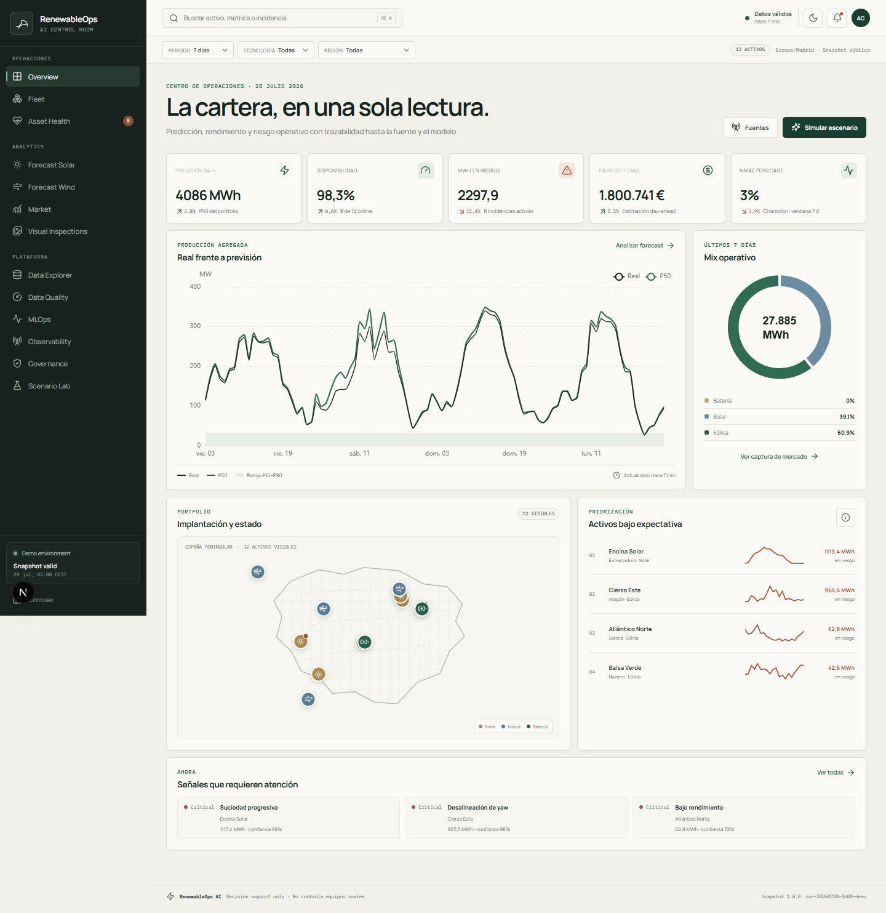
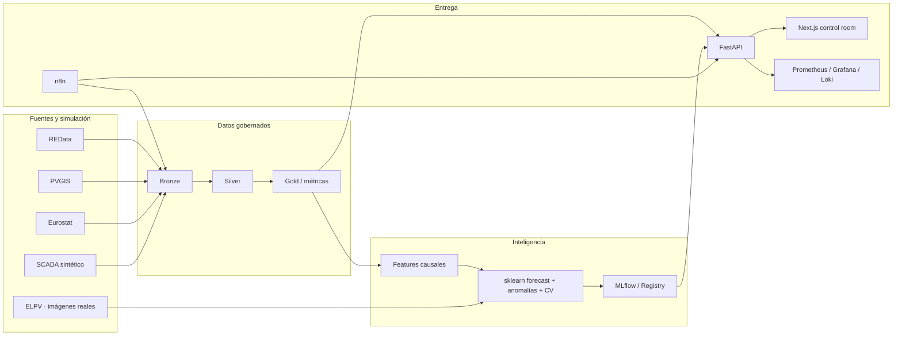

# RenewableOps AI

Plataforma reproducible de operaciones renovables que une ingeniería de datos,
forecasting, detección de anomalías, visión clásica, MLOps y gobierno en una
única demo honesta. Opera sobre un portfolio ficticio de 12 activos en España,
datos SCADA sintéticos claramente etiquetados y fuentes oficiales con
procedencia visible.

> Sistema de apoyo a decisiones. No controla equipos, no ejecuta trading y no
> sustituye una inspección técnica ni una evaluación legal.

[Demo en producción](https://renewableops-ai.vercel.app)



## Qué está terminado

- Lakehouse local Bronze/Silver/Gold en Parquet, manifiestos y checksums.
- Seed operativo de 25.920 observaciones horarias y perfil de escala reproducible
  de 2.522.928 filas a cinco minutos, 12 activos, dos años y 20 escenarios.
- Ingesta real y acotada de REData, PVGIS y Eurostat, con payload Bronze,
  timestamp, schema fingerprint, SHA-256 y estado por fuente; AEMET permanece
  desactivada hasta que el propietario aporte su clave.
- Forecast solar y eólico: cinco candidatos sklearn, cinco baselines, selección
  con tres folds temporales y gap de 24 h, test final intacto, P10/P50/P90
  entrenados y error medido por horizonte 1–48 h.
- Anomalías por reglas físicas, residuos e Isolation Forest.
- Clasificador visual sklearn sobre las 2.624 imágenes reales de ELPV, con HOG,
  LBP, textura, cinco candidatos, calibración y métricas por célula mono/poly.
- Registry local Champion/Challenger, diez candidatos reflejados en MLflow
  local y promoción siempre sujeta a aprobación humana.
- FastAPI versionada, métricas Prometheus, IDs de correlación y validación de
  imágenes.
- Dashboard Next.js con 13 áreas, filtros persistentes, escenarios, responsive,
  tema dual, estados de error y procedencia visible; ninguna métrica presentada
  es decorativa.
- PostgreSQL, MinIO, MLflow, n8n, Prometheus, Grafana, Loki, Redis y Spark por
  perfiles Docker.
- Bundle Databricks con Lakeflow pipeline, Jobs, SQL de Unity Catalog, metric
  views y dashboard AI/BI versionado.
- Terraform Azure no aplicado y Kubernetes/Helm de referencia.
- Threat model, cards, registro de riesgos, incident response, SBOM CycloneDX y
  cadena de auditoría hash.

## Arranque rápido

Requisitos: Python 3.11/3.12, [uv](https://docs.astral.sh/uv/), Node 22 LTS,
npm 11 y, para la plataforma completa, Docker Desktop.

```powershell
.\scripts\bootstrap.ps1
uv run renewableops run-demo --days 90
npm run dev
```

Abre [http://localhost:3000](http://localhost:3000). En otra terminal:

```powershell
uv run uvicorn renewableops_api.main:app --reload --port 8000
```

OpenAPI queda en [http://localhost:8000/docs](http://localhost:8000/docs).
El seed ya está versionado, por lo que el dashboard también arranca sin
reentrenar.

En macOS/Linux:

```bash
./scripts/bootstrap.sh
uv run renewableops run-demo --days 90
npm run dev
```

## Validación

```bash
make lint
make test
make security
make verify
```

Equivalente en PowerShell:

```powershell
uv run ruff check .
uv run pytest
npm run lint
npm run typecheck
npm run test:ui
npm run test:e2e
npm run build
uv run pip-audit
uv run bandit -r packages apps/api/src scripts -x tests -lll -q
docker compose config --quiet
uv run python scripts/verify_environment.py
```

Las pruebas PySpark se activan con `uv sync --extra platform` y un JDK compatible
declarado en `JAVA_HOME`; si no están disponibles, se omiten explícitamente. Los
tests E2E requieren:

```bash
npx playwright install chromium
npm run test:e2e
```

La demo guiada reproducible está documentada en
[`docs/demo/demo-script.md`](docs/demo/demo-script.md) y puede grabarse de
nuevo con `.\scripts\record_demo.ps1`. La evidencia WebM queda en
`artifacts/demo/renewableops-guided-demo.webm`.

## Servicios locales

```bash
docker compose --profile core up -d --build
docker compose --profile monitoring up -d
docker compose --profile streaming up -d
docker compose --profile scale up -d
```

Para hot reload explícito de la API en contenedor:

```bash
docker compose -f docker-compose.yml -f docker-compose.dev.yml --profile core up -d
```

| Superficie | URL local | Perfil |
|---|---:|---|
| Dashboard | `localhost:3000` | core |
| FastAPI | `localhost:8000` | core |
| MLflow | red interna; exponer solo para desarrollo | core |
| n8n | `localhost:5678` | core |
| Grafana | `localhost:3001` | monitoring |
| Prometheus | `localhost:9090` | monitoring |
| Spark UI | `localhost:8088` | scale |

Las contraseñas por defecto contienen `local_only` y son exclusivamente para
loopback. Copia `.env.example`, genera secretos propios y no expongas los
servicios a una red compartida con esos valores.

## Arquitectura



El núcleo local usa Pandas/NumPy por simplicidad operativa. La equivalencia de
escala vive en PySpark y Databricks con Delta, Lakeflow y Unity Catalog. Más
detalle en [arquitectura](docs/architecture/overview.md).

## Datos y rigor

- `source_id`, `is_synthetic`, versión, ventana temporal, recuento, schema hash
  y content hash acompañan cada dataset.
- Todo tiempo canónico es UTC; la presentación usa Europe/Madrid.
- Los lags y rollings usan `shift(1)` antes de agregar, evitando mirar el
  objetivo presente.
- El holdout son los últimos 14 días, nunca un split aleatorio.
- La ingesta oficial es acotada: `renewableops ingest` consulta REData, PVGIS y
  Eurostat; una fuente no configurada o fallida conserva evidencia explícita y
  nunca se presenta como éxito.
- Los snapshots públicos excluyen secretos, correo, identificadores personales
  y payloads de fuentes crudos.

## Databricks

La carpeta [databricks](databricks/README.md) contiene el bundle declarativo,
pipeline Lakeflow, Jobs diario/semanal, modelo UC y dashboard AI/BI. Se puede
validar localmente, pero desplegar y ejecutar requiere que el propietario
autentique su propio workspace:

```bash
databricks auth login --host <workspace-url> --profile renewableops-free
databricks bundle validate -t dev
databricks bundle deploy -t dev
databricks bundle run renewableops_daily -t dev
```

La automatización no crea cuentas, no acepta términos ni consume capacidad de
un workspace sin autorización.

## Mapa del repositorio

- `apps/`: API y dashboard.
- `packages/core/`: datos, ML, anomalías, visión, auditoría y optimización.
- `data/`: contratos, registry de fuentes, lakehouse demo y snapshots.
- `databricks/`: bundle, Lakeflow, Jobs, SQL y AI/BI.
- `workflows/n8n/`: seis workflows importables.
- `infra/`: Docker observability, Kubernetes, Helm y Terraform Azure.
- `governance/`: system/model/data cards, riesgos, cumplimiento e incidentes.
- `docs/`: arquitectura, runbooks, API y demo.
- `tests/`: unit, contrato, modelo, seguridad, integración y E2E.

## Limitaciones conocidas

Los activos, fallos y SCADA son ficticios. Los benchmarks no prueban
generalización a una planta real. El módulo de batería es una heurística
transparente, no un despacho de mercado. El despliegue remoto de Databricks y
Azure no puede demostrarse sin credenciales y queda separado de la validación
local; el registro exacto está en [estado de aceptación](docs/acceptance.md).

## Licencia

Código MIT. Los datos externos conservan sus propias licencias, condiciones y
atribuciones; revisa `data/source_registry.yaml` antes de redistribuirlos.
