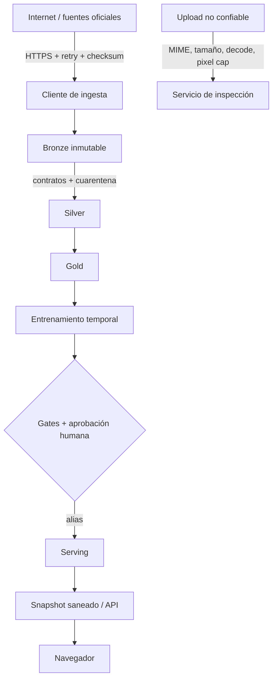

# Arquitectura y decisiones

## Límites de confianza

Internet, uploads, webhooks y el navegador son zonas no confiables. Bronze
conserva evidencia; Silver aplica tipos, UTC, deduplicación y reglas físicas;
Gold define grano explícito. Ningún modelo se autopromociona a producción.

## Decisiones

1. Pandas/NumPy son el núcleo gratuito y auditable.
2. sklearn aporta baselines y candidatos comparables.
3. Parquet permite ejecución local sin servicios.
4. UTC es canónico y Europe/Madrid es presentación.
5. Los snapshots públicos desacoplan demo y backend.
6. PySpark/Databricks prueban un camino de escala sin fingir que el dataset
   pequeño lo necesita.
7. n8n coordina servicios; no duplica lógica de transformación.

Las consecuencias y alternativas se documentan en `docs/architecture/adr/`.

## Lineage

`source → bronze → silver → gold → features → model → prediction → KPI`

Los manifiestos incluyen inputs, versiones, commit, parámetros, recuentos,
quality status, owner y timestamps. PostgreSQL tiene la tabla
`renewableops.dataset_lineage`; Databricks añade lineage de Unity Catalog.
